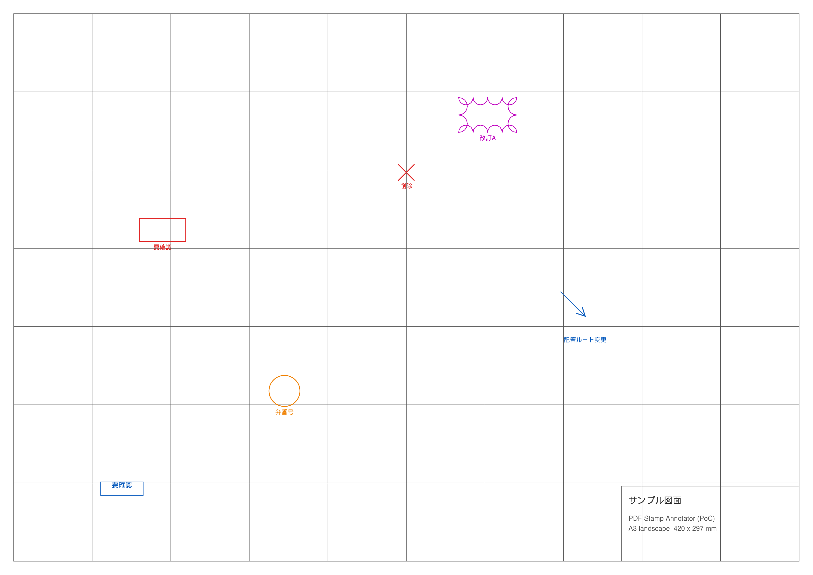
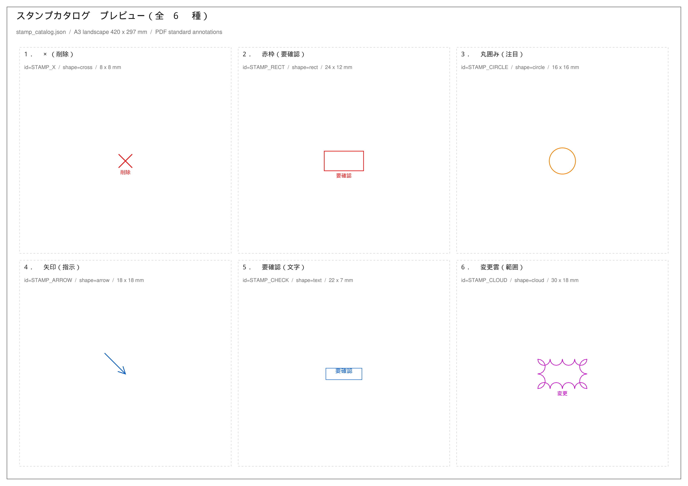

# PDF図面向け インタラクティブ スタンプ・アノテーション配置アプリ (PoC)

macOS + Python 3.10+ / PySide6 + PyMuPDF で動作する概念実証。
図面 PDF をキャンバスに表示し、パレットで選んだスタンプをクリック位置に配置して、
**元ファイルを一切変更せずに**別名の PDF へ書き出す。

## セットアップ

```bash
python3 -m venv .venv && source .venv/bin/activate
pip install -r requirements.txt
```

## 使い方

```bash
# GUI（起動時に PDF を開く場合は引数で渡す）
python app.py 図面.pdf

# 動作確認（サンプル A3 図面を自動生成し、JSON 一括配置 → 2モードで書き出し）
python app.py --selftest --output out/stamped.pdf

# ヘッドレス一括処理（PySide6 不要。AI が出した JSON をそのまま流し込む）
python app.py --batch --input 図面.pdf --annotations ann.json --output 出力.pdf
```

### 目視確認用のプレビュー画像

```bash
python app.py --preview --out-dir out --dpi 200
```

`out/` に以下を書き出す（中間 PDF は `.gitignore` 済み。PNG のみコミットしている）。

| ファイル | 内容 |
| --- | --- |
| `out/preview_stamped_page1.png` | サンプル図面にスタンプを配置した結果（ページごと） |
| `out/stamp_catalog_preview.png` | カタログ全種を並べた一覧 |

いずれも**通常の配置パイプライン**（`apply_json_annotations()` → `save_pdf()`）で作った
PDF を `annots=True` でレンダリングした実物で、プレビュー専用の描画経路は持たない。

#### 配置結果（200dpi）



#### スタンプ一覧（200dpi）



### 画面操作

| 操作 | 動作 |
| --- | --- |
| 左クリック / ペン先 | 選択中のスタンプを配置 |
| 右クリック / ペン消しゴム | クリック位置のスタンプを削除 |
| `⌘Z` | 直前の配置を取り消し |
| `⌘[` / `⌘]` | 前 / 次ページ |
| `⌘-` / `⌘+` / `⌘0` | 縮小 / 拡大 / 幅に合わせる |
| `⌘O` / `⌘S` | 開く / 別名保存 |
| JSON読込 / JSON書出 | アノテーションの入出力（AI 連携の往復） |

ステータスバーには常に **比率座標と用紙上の mm 位置**が出るので、
AI へ渡す JSON の座標を画面上で確認できる。

## アーキテクチャ（DocuWorks への差し替えを前提とした 3 層分離）

```
  ┌─ コア層 ────────────────────────────────────────────┐
  │  StampCatalog  : stamp_catalog.json の読み込み        │
  │  Placement     : page / symbol_id / norm_x,y (0.0-1.0)│
  │  AnnotationDocument : PDF と配置リストの保持           │
  └──────────────────────┬────────────────────────────┘
                         │ build_primitives()
                         │   比率座標 → 用紙絶対座標 pt
                         ▼
                 ┌─ Prim（描画プリミティブ）─┐
                 │ stroke / arrow / rect /   │
                 │ ellipse / text            │
                 └───────┬──────────┬───────┘
                         │          │
            画面プレビュー│          │出力
              (QPainter) │          ▼
                         │   ┌─ Exporter 層 ──────────────┐
                         │   │ PyMuPDFExporter   (.pdf)    │  ← Mac（実装済み）
                         ▼   │ DocuWorksExporter (.xdw)    │  ← Windows（将来）
                   PdfCanvas └─────────────────────────────┘
```

* プレビューと出力が**同じ `build_primitives()` の結果**を描くため、画面と成果物が一致する。
* 座標は常に **用紙サイズに対する比率 (0.0–1.0, 原点=左上)** で保持し、
  出力時にだけ絶対座標 (pt) へ変換する。A3 / A1 など用紙が変わっても配置が崩れない。
* スタンプの寸法は **mm 実寸**で定義するので、用紙サイズによらず見かけの大きさが一定になる。

### Windows / DocuWorks への移行

`DocuWorksExporter.export()` を `xdwlib` で実装するだけでよい。コア層は変更不要。

| `Prim.kind` | DocuWorks アノテーション |
| --- | --- |
| `stroke` | `XDW_AID_STRAIGHTLINE` の連結 / `FREEHAND` |
| `arrow` | `XDW_AID_ARROW` |
| `rect` | `XDW_AID_RECTANGLE` |
| `ellipse` | `XDW_AID_ARC`（楕円） |
| `text` | `XDW_AID_TEXT` |

座標単位は pt（1/72 inch）→ DocuWorks は 1/100 mm。`DocuWorksExporter.pt_to_xdw()` で換算する。

## スタンプカタログ (`stamp_catalog.json`)

```json
{
  "defaults": { "line_width": 1.2, "font_size_pt": 9.0, "label_gap_mm": 1.5 },
  "stamps": [
    {
      "id": "STAMP_X",
      "label": "✖（削除）",
      "shape": "cross",
      "color": "#E02020",
      "size_mm": [8.0, 8.0],
      "line_width": 1.6,
      "default_text": "削除",
      "show_label": true
    }
  ]
}
```

* `shape`: `cross` / `rect` / `circle` / `arrow` / `text` / `cloud`
* `color`: `"#RRGGBB"` でも `[r, g, b]`（0.0–1.0 / 0–255）でも可
* `size_mm`: 用紙上の実寸 `[幅, 高さ]`
* `angle_deg`: `arrow` の向き（既定 225° = 左上から右下へ向く矢印）

スタンプを増やしたいときは JSON にエントリを足すだけでよい（コード変更不要）。

## AI / JSON 連携

```python
from app import StampCatalog, AnnotationDocument, save_pdf

doc = AnnotationDocument(StampCatalog.load(), "図面.pdf")
doc.apply_json_annotations([
    {"page": 0, "symbol_id": "STAMP_X",    "norm_x": 0.5, "norm_y": 0.3, "text": "削除"},
    {"page": 0, "symbol_id": "STAMP_RECT", "norm_x": 0.2, "norm_y": 0.4, "text": "要確認"}
])
save_pdf(doc, "図面_stamped.pdf")          # 元ファイルは無変更
```

* 必須キー: `symbol_id` / `norm_x` / `norm_y`（`page` は省略時 0）
* 任意キー: `text`, `scale`, `angle_deg`, `color`
* 入力は **配列 / `{"annotations": [...]}` / JSON 文字列 / `.json` のパス** のいずれでも受け付ける
* **全件を検証してから一括適用**する。1 件でも不正なら何も変更しない
* GUI 側は `MainWindow.apply_json_annotations()` が同じ API を提供し、適用後に再描画する
* `AnnotationDocument.to_json()` で現在の配置を書き出せる（AI への往復用）

## 出力モード

| mode | 内容 | 用途 |
| --- | --- | --- |
| `annotation`（既定） | PDF 標準注釈（Ink / Line / Square / Circle / FreeText） | ビューアで選択・削除・コメント参照ができる非破壊レビュー |
| `vector` | ページ内容へのベクトル描画 | 注釈非対応の下流ツールへ渡す確定版 |

`annotation` モードでは各注釈の作成者に `PDF Stamp PoC`、コメントに
`スタンプ名 / ID / ページ / 比率座標` を埋めるので、後から機械的に読み戻せる。

## 制限（PoC のため）

* 配置後の**ドラッグ移動・回転は未対応**（削除して置き直す）
* 日本語は PyMuPDF 組込みの CJK フォントで描画する。FreeText 注釈の見た目は
  ビューアが外観を再生成する場合に変わることがある。確定版が必要なら `vector` モードを使う
* 「変更雲」は矩形外周に半円を並べた近似形状
